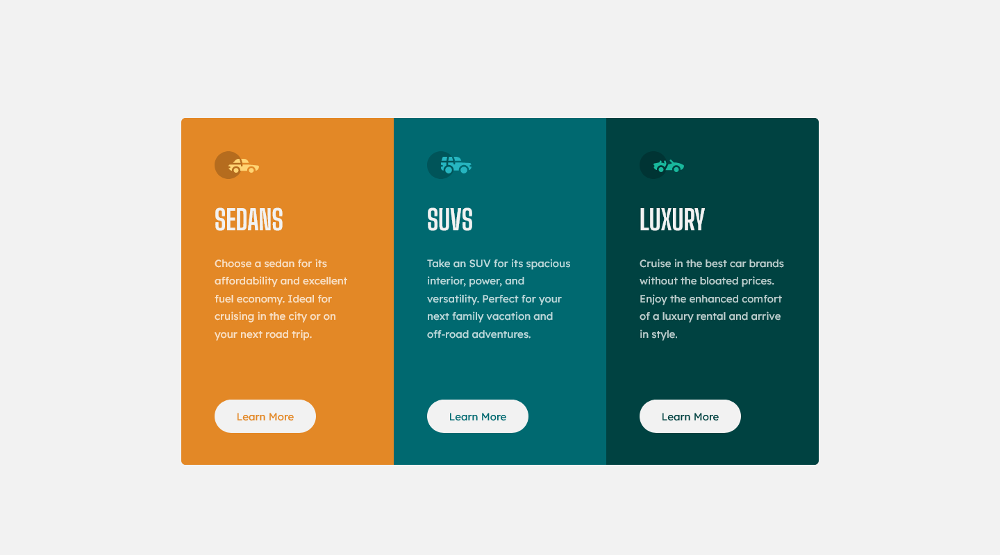

# Frontend Mentor - 3-column preview card component solution

This is a solution to the [3-column preview card component challenge on Frontend Mentor](https://www.frontendmentor.io/challenges/3column-preview-card-component-pH92eAR2-).

## Table of contents

- [Frontend Mentor - 3-column preview card component solution](#frontend-mentor---3-column-preview-card-component-solution)
  - [Table of contents](#table-of-contents)
  - [Overview](#overview)
    - [The Challenge](#the-challenge)
    - [Screenshot](#screenshot)
    - [Links](#links)
  - [My Process](#my-process)
    - [Project Goals](#project-goals)
    - [Built with](#built-with)
    - [What I Learned](#what-i-learned)
    - [Major Challenges](#major-challenges)
    - [Continued Development](#continued-development)
    - [Useful Resources](#useful-resources)
  - [Author](#author)

## Overview

### The Challenge

Users should be able to:

- View the optimal layout depending on their device's screen size
- See hover states for interactive elements

### Screenshot

### Links

- Solution URL: [GitHub](https://github.com/gnjmonroe/3-column-preview-card-component-main)
- Live Site URL: [Live Site](https://gnjmonroe.github.io/3-column-preview-card-component-main/)

## My Process

### Project Goals

- Continue practicing semantic HTML.
- Continue practicing SCSS concepts.
- Continue practicing the process of setting up for a project more so than executing said project.
- Achieve as close to a perfect replica as reasonably possible (e.g., 100% accurate spacing values are not worth an hour of time).

### Built with

- Semantic HTML5 markup
- Sass/SCSS
  - Partials, variables, etc.
- CSS Style Guide (BEM)
- Flexbox
- Mobile-first workflow

### What I Learned

Compared to the last project, this was a breeze. I probably should have started with this project actually. I think it took me roughly 2 hours, including a generous planning stage. That said, I'm not sure that I learned that much. I can certainly say that I was much more comfortable in my workflow and technology stack this time around but I think I'm ready to up my game in the next project.

### Major Challenges

N/A

### Continued Development

I think the best thing I can do is to start doing harder projects ASAP. In preparation for that, I'll read [This](https://css-tricks.com/approaches-media-queries-sass/) and [this](https://www.sitepoint.com/managing-responsive-breakpoints-sass/) before the next project. I actually forgot to read them before this one.

In the next project, I'll also include a section in the README for a time budget estimate and how long it actually took me. I think this will be a good way work on my time estimation skills that I mentioned in the previous project.

Addition semantic HTML practice will be helpful too. 

### Useful Resources

- [BEM](http://getbem.com/introduction/) - The official BEM documentation.
- [CSS Reset Documentation](https://piccalil.li/blog/a-modern-css-reset/).
- [Example resource 1](https://www.example.com) - 

## Author

- Website - [Gregory Nathan Jinsoo Monroe](https://www.jinsoo.co)